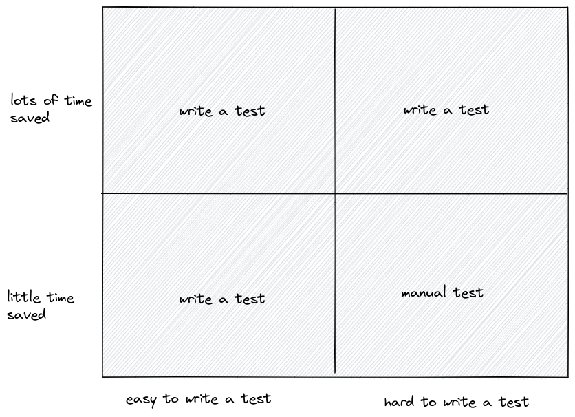

# Table of Contents

- [Table of Contents](#table-of-contents)
- [Automated Testing](#automated-testing)
  - [Introduction to automated testing](#introduction-to-automated-testing)
    - [Purpose of automated testing](#purpose-of-automated-testing)
    - [Definition of automated testing](#definition-of-automated-testing)
    - [Testing Libraries](#testing-libraries)
    - [Scope](#scope)
  - [Agnostic Testing Rules](#agnostic-testing-rules)
    - [Independent tests](#independent-tests)
    - [Test only one thing](#test-only-one-thing)
    - [Test output separately from errors](#test-output-separately-from-errors)
    - [Test code usage](#test-code-usage)
    - [Additional rules](#additional-rules)
  - [Procedure](#procedure)
- [Manual Testing](#manual-testing)
  - [Introduction to manual testing](#introduction-to-manual-testing)
    - [When to do manual testing](#when-to-do-manual-testing)
    - [Definition of manual testing](#definition-of-manual-testing)
  - [Protocol for manual testing](#protocol-for-manual-testing)
    - [Batches](#batches)
    - [Spreadsheets](#spreadsheets)
    - [Test suites and systems](#test-suites-and-systems)
    - [Procedure](#procedure-1)
    - [Testers](#testers)
    - [Testing is done by the team](#testing-is-done-by-the-team)
    - [Failed tests](#failed-tests)

# Automated Testing

## Introduction to automated testing

### Purpose of automated testing

There are three primary reasons for writing tests (in no particular order):

1. Ensure the code performs as expected and does not produce unintended results.
2. Provide examples of how to use the code being tested.
3. Verify the successful integration of our system with itself and external dependencies.

Ultimately, the goal is to save time that would otherwise be spent on finding and fixing bugs or understanding the code's purpose.

While testing is valuable, it should not be solely relied upon for security or bug-free code. Trusting a test suite to be more correct than production code would be irresponsible. Achieving 100% validity and truthfulness in your code through testing would mean you have solved the halting problem.

### Definition of automated testing

Testing refers to the process of writing code that can be automatically executed to verify reasons 1 and 3 and demonstrate reason 2 through code review and/or output analysis.

> A test can be automatically run.

A test that checks for reason 1 is called a unit test.
A test that checks for reason 3 is called an integration test.
The test itself and the test's output should cover reason 2.

### Testing Libraries

Choose a testing library that facilitates achieving all three testing goals:

- Easily write tests for individual functions.
- Clearly present what the test is doing in both code and output.
- Simplify writing tests that check for integration.

### Scope

It is essential to determine the scope of testing and what can be left untested.
Leaving some aspects untested is acceptable, but it is crucial to be aware of the untested components and why they are not tested. If something remains untested, complete the three reasons for testing by writing documentation.

## Agnostic Testing Rules

### Independent tests

All tests should be independent of the implementation of the code being tested, meaning tests should not depend on the internal workings of the code they are testing.

This is important because if the code being tested changes, the tests should not need to change. The test's responsibility is to ensure the code passes.

### Test only one thing

Each test should describe what it is testing and only test one aspect.

- If writing an integration test, it should only test the code's integration, not individual functions.
- If writing a unit test, it should only test the individual function.

### Test output separately from errors

If a function returns a value, test for the returned value.
If a function throws an error, test for the thrown error.
These two scenarios are mutually exclusive, so they should be tested separately.

### Test code usage

Tests should be written to verify the way the code is used, considering the overall system context and testing edge cases.

### Additional rules

- Each function or method should have at least one unit test.
- Test edge cases and expected failure scenarios.
- Test input validation and error handling.
- Create integration tests for interactions between modules and external dependencies.
- Use consistent naming conventions for test files and functions.
- Write clear and concise test descriptions that are easy to understand.
- Organize tests logically and group related tests together.
- Maintain test code cleanliness and maintainability, as with production code.

## Procedure

Run all automated tests before merging a pull request into the master or develop branch.

# Manual Testing

## Introduction to manual testing

In an ideal world, we would have 100% test coverage and never require manual testing. However, manual testing might be needed for two main reasons:

- Some aspects are difficult to write tests for and are not worth the time saved.
- Double-check that automated tests are correct and cover all cases.

### When to do manual testing

### Definition of manual testing

Manual testing is not meant to be repeated often; it should be done on any public release of the system for all untested features that were touched in the release (even if they have been manually tested before).

## Protocol for manual testing

### Batches

Manual testing will be done in "batches". Each time manual testing is going to be done (usually before a release), a new batch is started.
Manual testing may also be done before a pull request is completed or after it has been completed to verify integration into the prod system.

### Spreadsheets

We use a spreadsheet to keep track of the manual tests that have been performed.

Each batch will have its own spreadsheet. The spreadsheet will have the following columns:

- Test name
- Test description
- Suite
- System
- Tester
- Procedure
  - A step-by-step procedure for how to perform the test.
  - More on this in the next section.
- Completed on
- Comments
  - This can be left empty if everything went as expected.
  - A failed test should have comments.

### Test suites and systems

Most manual tests will and probably should only cover one system. However, often there will be lines between the different tests that are being run.
This is where suites come into play, just make sure that they are being separated and be aware that one failed test in a test suite often means that all other tests in that suite will need to be retested.

### Procedure

The procedure is a step-by-step guide on how to perform the test. The procedure should be written in a way that makes it easy to follow and should be detailed enough to ensure the test is carried out consistently by different testers. Here are some guidelines for writing an effective procedure:

1. Break down the test into small, manageable steps.
2. Use clear and concise language, avoiding jargon or ambiguous terms.
3. Include any prerequisites or requirements before starting the test, such as logging in, setting up the environment, or accessing specific tools.
4. Describe the expected outcome or result for each step, so the tester can easily identify if the test passes or fails.
5. Provide guidance on how to handle unexpected results, errors, or issues that may arise during the test.
6. Include any necessary screenshots, diagrams, or links to documentation for better understanding.
7. Specify the criteria for determining whether the test has passed or failed overall.
8. Mention any cleanup or post-test steps that should be performed, such as logging out, resetting the environment, or documenting the test results.

By following these guidelines, the procedure will be comprehensive and easy to understand, ensuring that manual tests are carried out consistently and accurately across different testers and test sessions.

### Testers

The testers are the people who will perform the manual tests. The testers should be chosen based on the following criteria:

1. They did not write the code being tested.

The tests should be written so detailed and thoughtfully that anyone can perform them and validate that the result is correct. And if the person who wrote the code is testing it, they may overlook bugs because they have been seeing them for so long.

If a test covers multiple sections of code that more than one person wrote (which will happen often because most manual tests will cover the whole system), then the test should be performed by multiple people such that each section of the code is being tested by someone who did not write it.

### Testing is done by the team

Manual testing is done by the whole team. This means that everyone should be involved in the testing process. This is done to ensure that the whole team is aware of the state of the system and to ensure that everyone is on the same page.
Not everyone needs to be given a test, but everyone should be aware of what is being tested and what the results are.

### Failed tests

If a test fails, the tester should immediately notify the person who wrote the code being tested. The tester should also notify the team that the test has failed and that the code should not be released until the test is fixed. If any code is changed, tests may need to be re-run to ensure that the changes did not break anything. Be very careful after changing the code; it may break other tests, so use common sense here.
